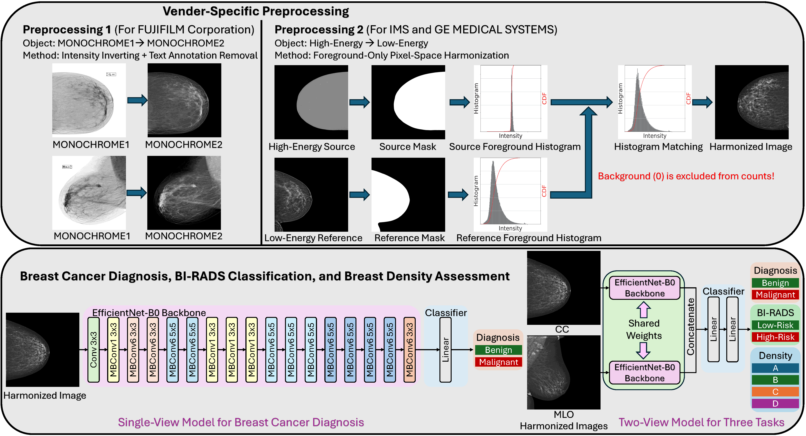
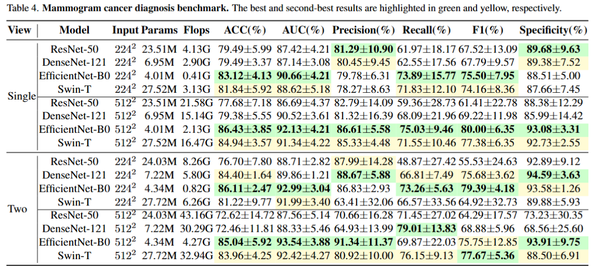
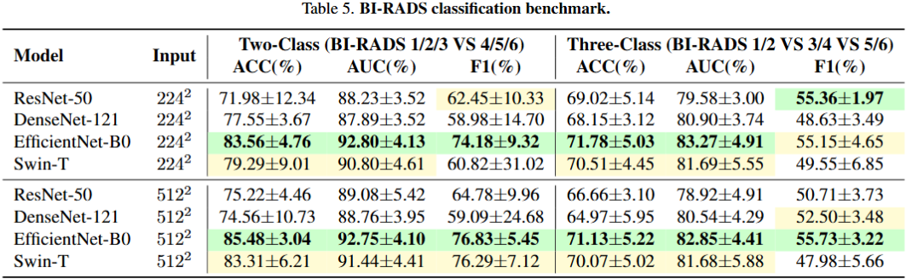
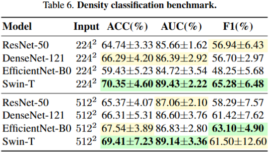

# [CVPR2026] LUMINA: A Multi-Vendor Mammography Benchmark with Energy Harmonization Protocol

  

  

# Paper link:
arXiv: https://arxiv.org/abs/2603.14644

# Dataset

Dataset on Kaggle: https://www.kaggle.com/datasets/phy710/lumina-mammography-dataset

Dataset on OSF: https://osf.io/b63jc/

Please download LUMINA_PNG, Benign_Cases.xlsx, and Malign_Cases.xlsx, then put the two xlsx files under LUMINA_PNG. Other files are provided for reference. You can create a folder called "dataset" and put LUMINA_PNG in it.

# (Optional) To harmonize LUMINA dataset (generate LUMINA and LUMINA_PNG using LUMINA_RAW):

    python harmonize.py --data-path PATH_TO_LUMINA_RAW -o ./LUMINA

# Training and Testing
In each task (Diagnosis, BIRADS, Density), go to the corresponding folder then run

    ./main.sh [-model model_name] [-input_size size] [-data_path data_path]

for CNNs. Here, [-input_size] can be 224 or 512, [-model] can be efficientnet_b0, densenet121, resnet50.

    ./main_swin.sh [-input_size size] [-data_path data_path]

for swin-T. Other models may be supported but not tested yet.
For example:

    ./main.sh -model efficientnet_b0 -input_size 224 -data_path /dataset/LUMINA_PNG

You can get the test results by running the command like the following:

    python fold_test.py --model --data-path /dataset/LUMINA_PNG --model efficientnet_b0 --input-size 224
Here, [--input-size] can be 224 or 512, [--model] can be efficientnet_b0, densenet121, resnet50, or swin_t.

The pretrained weights are available at Hugging Face: https://huggingface.co/phy710/LUMINA 

Please put the folder "saved"  into the corresponding task.

# Benchmark

  

  

  

# Citation
If you use this dataset in your research, please cite our CVPR 2026 paper:

    Hongyi Pan, Gorkem Durak, Halil Ertugrul Aktas, Andrea M. Bejar, Baver Tutun, Emre Uysal, Ezgi Bulbul, Mehmet Fatih Dogan, Berrin Erok, Berna Akkus Yildirim, Sukru Mehmet Erturk, Ulas Bagci. "LUMINA: A Multi-Vendor Mammography Benchmark with Energy Harmonization Protocol." CVPR 2026.
